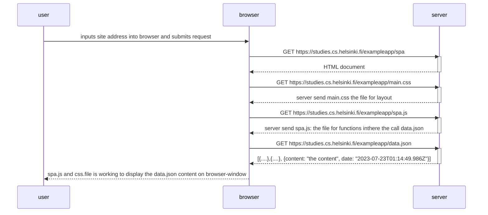

# display: The user-browser-server interaction of the SPA

```mermaid
sequenceDiagram
participant user
participant browser
participant server

user->>browser: inputs site address into browser and submits request
browser->>server: GET https://studies.cs.helsinki.fi/exampleapp/spa
activate server
server-->>browser: HTML document
deactivate server

browser->>server: GET https://studies.cs.helsinki.fi/exampleapp/main.css
activate server
server-->>browser: server send main.css the file for layout
deactivate server

browser->>server: GET https://studies.cs.helsinki.fi/exampleapp/spa.js
activate server
server-->>browser: server send spa.js: the file for functions inthere the call data.json
deactivate server

browser->>server: GET https://studies.cs.helsinki.fi/exampleapp/data.json
activate server
server-->>browser: [{....},{....}, {content: "the content", date: "2023-07-23T01:14:49.986Z"}]
deactivate server

browser-->>user:spa.js and css.file is working to display the data.json content on browser-window

```